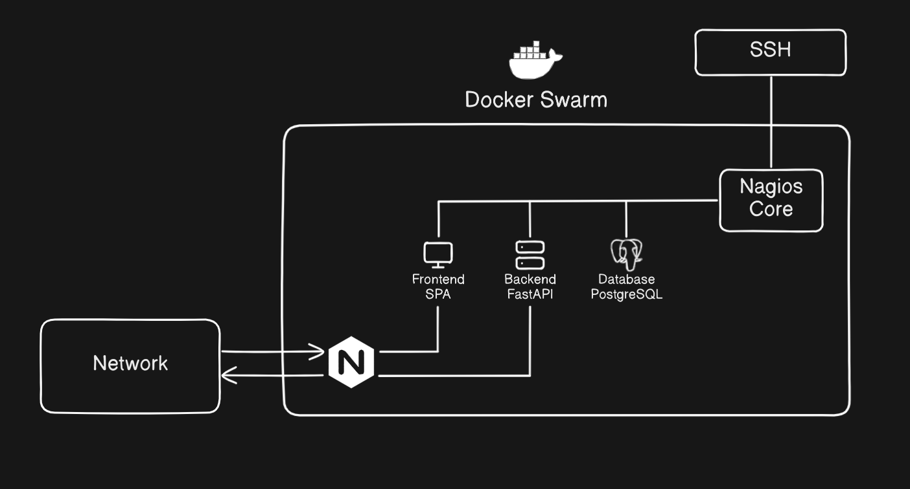
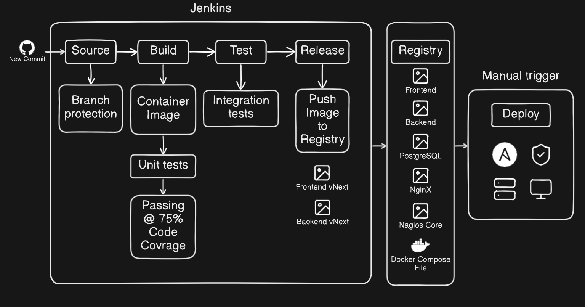

<h2>Containerization, Deployment and Monitoring</h2>

Once we developed our Service, we might want to make it publicly aviable.   
For this purpuse, the most convinient way is to use some kind of remote server.  
If we want to our Service to function uniformly between platforms,  
it is a handy solution to containerizate. My choise of Containerization tool is Docker.  
My server is on the lower end, so I will use Docker Swarm as Orchestration tool,  
but I will detail how to achive the same results with Kubernetes too.  
In the end we will watch the different monitoring technics of the Server and our Service.

<h3>Service Mesh</h3>

<h3>CI/CD Pipeline</h3>
